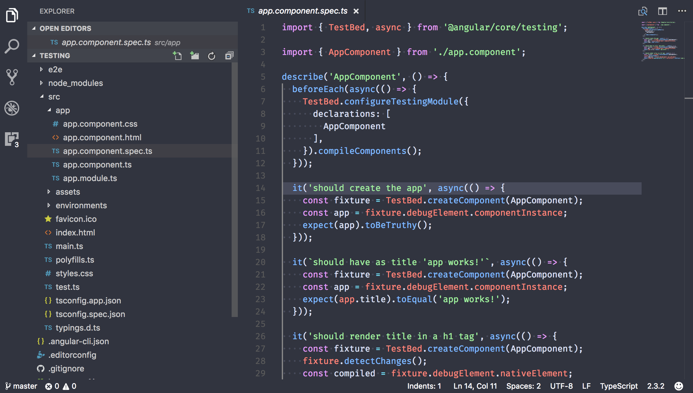

# One Dark Vivid

VS Code theme based off of Atom's [One Dark Vivid](https://atom.io/themes/one-dark-vivid-syntax), using the config of VS Code's [One Dark Pro](https://marketplace.visualstudio.com/items?itemName=zhuangtongfa.Material-theme) as boilerplate.

  

## Screenshot
Screenshot of Angular 2 Boilerplate

